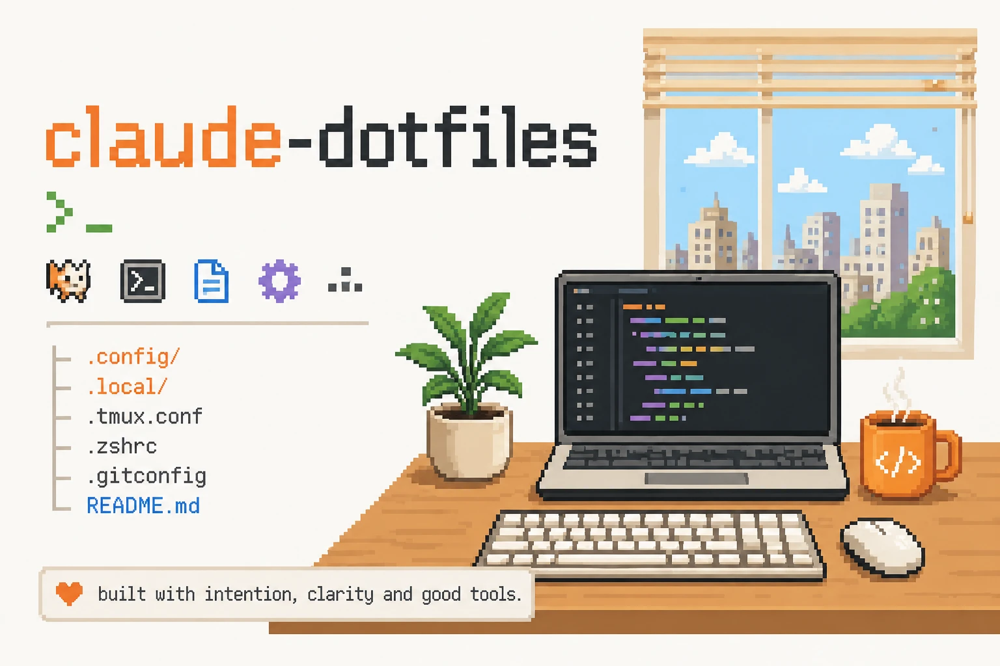

# claude-dotfiles



> Install everything by copying [INSTALL.md](./INSTALL.md) into Claude Code and following the prompt.

Personal Claude Code defaults for orchestrated software development. The primary agent investigates, plans, reviews, and approves. Three cheaper Sonnet subagents handle implementation, runtime verification, and pull-request publication.

## Workflow

1. The primary agent investigates the repository and approves a concrete plan.
2. `sonnet-max-implementer` implements and validates the plan.
3. The primary agent reviews the actual diff and sends substantive fixes back to the same implementer.
4. `sonnet-evidence-verifier` runs the app locally, exercises the changed behavior, and captures screenshot and log evidence.
5. The primary agent performs final acceptance against that evidence.
6. `sonnet-pr-writer` creates the branch, commit, push, and pull request.

Small mechanical changes can stay in the primary agent when delegation would cost more than the work.

## Contents

```text
agents/
  sonnet-max-implementer.md
  sonnet-evidence-verifier.md
  sonnet-pr-writer.md
skills/
  orchestrated-development/
    SKILL.md
INSTALL.md
```

- [`orchestrated-development`](./skills/orchestrated-development/SKILL.md) defines investigation, implementation, review, verification, and publication.
- [`sonnet-max-implementer`](./agents/sonnet-max-implementer.md) is the only write-heavy implementation worker (Sonnet, effort max).
- [`sonnet-evidence-verifier`](./agents/sonnet-evidence-verifier.md) runs the app and captures evidence, without touching source (Sonnet, effort high).
- [`sonnet-pr-writer`](./agents/sonnet-pr-writer.md) handles approved Git and pull-request operations (Sonnet, effort medium).

Verification evidence is written to `~/claude-workflows/<ticket-id-or-slug>/evidences`, outside every repository so it can never be committed into the pull request.

The primary model is whatever the Claude Code session runs (e.g. Opus/Fable). The subagents explicitly pin `model: sonnet` with different reasoning efforts in their frontmatter.

## Workflow dependencies

- [Ponytail](https://github.com/DietrichGebert/ponytail) keeps implementations minimal.
- [Caveman](https://github.com/JuliusBrussee/caveman) provides concise communication and commit-message skills.

The installation prompt detects these dependencies and installs only what is missing. Their absence never blocks the workflow.

## Installation model

The installer creates links only for files owned by this repository:

```text
~/.claude/skills/orchestrated-development
~/.claude/agents/sonnet-max-implementer.md
~/.claude/agents/sonnet-evidence-verifier.md
~/.claude/agents/sonnet-pr-writer.md
```

It does not link or replace the whole `~/.claude` directory, so authentication, history, settings, memory, other agents, and other skills remain local.

See the official Anthropic documentation for [skills](https://code.claude.com/docs/en/skills) and [subagents](https://code.claude.com/docs/en/sub-agents).
